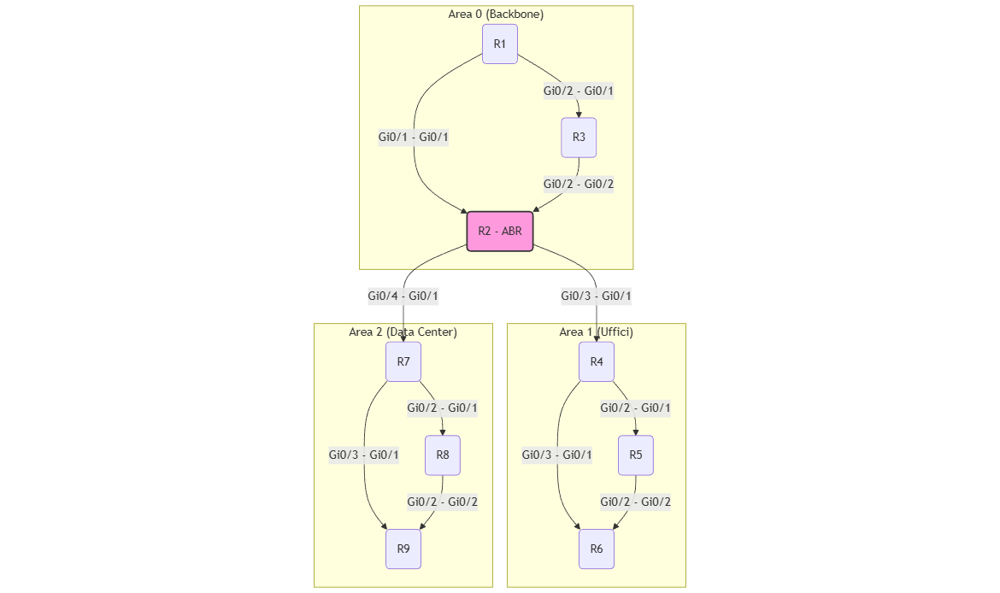

# Laboratorio: Design OSPF Scalabile (Single-Area vs. Multi-Area)

Questo repository contiene un laboratorio PNetLab progettato per analizzare, testare e confrontare due diversi approcci di design per un routing domain OSPF.

## 🎯 Obiettivo del Laboratorio

Comprendere e dimostrare, attraverso test pratici, perché un design OSPF **Multi-Area (gerarchico)** è architetturalmente superiore a un design **Single-Area (piatto)** in termini di:

* **Efficienza:** Riduzione della dimensione della Link-State Database (LSDB) e della tabella di routing sui router non-backbone.
* **Stabilità:** Limitazione dell'impatto sulla CPU (ricalcolo SPF) solo all'area interessata da un guasto.
* **Scalabilità:** Isolamento dei guasti, che impedisce a un link instabile in un'area di compromettere la stabilità dell'intera rete.

## 🛠️ Prerequisiti

* **Piattaforma:** PNetLab
* **Immagine:** Cisco vIOS (es. `vios-adventerprisek9-m.vmdk`)
* **Router:** 9

## 🔬 Struttura del Laboratorio

Il laboratorio è diviso in due fasi principali per confrontare direttamente i due approcci di design.

### Fase 1: Il Design "Piatto" (Tutto in Area 0)

In questa fase, tutti i 9 router sono configurati per appartenere a un'unica Area OSPF (Area 0), simulando una rete cresciuta "organicamente". Vengono eseguiti test per analizzare:

* La tabella di routing (tutte rotte "O" Intra-Area).
* La dimensione della LSDB (identica su tutti i router).
* L'impatto di un guasto (link flap), che forza tutti i router della rete a ricalcolare l'SPF.

### Fase 2: Il Design Gerarchico (Multi-Area)

La configurazione viene modificata (refactoring) senza cambiare il cablaggio. La rete viene suddivisa in Area 0 (Backbone), Area 1 e Area 2, trasformando R2 in un **Area Border Router (ABR)**. Vengono ripetuti gli stessi test della Fase 1 per dimostrare i vantaggi:

* Le tabelle di routing ora distinguono tra rotte "O" (Intra-Area) e "O IA" (Inter-Area).
* La LSDB sui router non-ABR è significativamente più piccola (contiene solo dettagli LSA Type 1/2 della propria area).
* Un guasto in un'area **non** causa un ricalcolo SPF nelle altre aree, isolando l'instabilità.

---

## 🔌 Piano di Cablaggio

| Dispositivo A | Interfaccia A | Dispositivo B | Interfaccia B | Area / Scopo |
| :--- | :--- | :--- | :--- | :--- |
| **Backbone** | | | | **Area 0** |
| R1 | Gi0/1 | R2 | Gi0/1 | R1 <-> R2 |
| R1 | Gi0/2 | R3 | Gi0/1 | R1 <-> R3 |
| R2 | Gi0/2 | R3 | Gi0/2 | R2 <-> R3 |
| **Area 1** | | | | **Area 1** |
| R2 | Gi0/3 | R4 | Gi0/1 | ABR <-> Area 1 |
| R4 | Gi0/2 | R5 | Gi0/1 | R4 <-> R5 |
| R4 | Gi0/3 | R6 | Gi0/1 | R4 <-> R6 |
| R5 | Gi0/2 | R6 | Gi0/2 | R5 <-> R6 |
| **Area 2** | | | | **Area 2** |
| R2 | Gi0/4 | R7 | Gi0/1 | ABR <-> Area 2 |
| R7 | Gi0/2 | R8 | Gi0/1 | R7 <-> R8 |
| R7 | Gi0/3 | R9 | Gi0/1 | R7 <-> R9 |
| R8 | Gi0/2 | R9 | Gi0/2 | R8 <-> R9 |

*(Dati estratti da Workbook_Laboratorio_ Design OSPF Scalabile (Single-Area vs. Multi-Area).pdf)*

---

## 🗺️ Tabella Indirizzamento IP

| Dispositivo | Interfaccia | Indirizzo IP | Subnet Mask |
| :--- | :--- | :--- | :--- |
| **R1 (Area 0)** | Loopback0 | `192.168.0.1` | `255.255.255.255` |
| | Gi0/1 | `10.0.12.1` | `255.255.255.0` |
| | Gi0/2 | `10.0.13.1` | `255.255.255.0` |
| **R2 (ABR)** | Loopback0 | `192.168.0.2` | `255.255.255.255` |
| | Gi0/1 | `10.0.12.2` | `255.255.255.0` |
| | Gi0/2 | `10.0.23.2` | `255.255.255.0` |
| | Gi0/3 | `10.1.24.2` | `255.255.255.0` |
| | Gi0/4 | `10.2.27.2` | `255.255.255.0` |
| **R3 (Area 0)** | Loopback0 | `192.168.0.3` | `255.255.255.255` |
| | Gi0/1 | `10.0.13.3` | `255.255.255.0` |
| | Gi0/2 | `10.0.23.3` | `255.255.255.0` |
| **R4 (Area 1)** | Loopback0 | `192.168.0.4` | `255.255.255.255` |
| | Gi0/1 | `10.1.24.4` | `255.255.255.0` |
| | Gi0/2 | `10.1.45.4` | `255.255.255.0` |
| | Gi0/3 | `10.1.46.4` | `255.255.255.0` |
| **R5 (Area 1)** | Loopback0 | `192.168.0.5` | `255.255.255.255` |
| | Gi0/1 | `10.1.45.5` | `255.255.255.0` |
| | Gi0/2 | `10.1.56.5` | `255.255.255.0` |
| **R6 (Area 1)** | Loopback0 | `192.168.0.6` | `255.255.255.255` |
| | Gi0/1 | `10.1.46.6` | `255.255.255.0` |
| | Gi0/2 | `10.1.56.6` | `255.255.255.0` |
| **R7 (Area 2)** | Loopback0 | `192.168.0.7` | `255.255.255.255` |
| | Gi0/1 | `10.2.27.7` | `255.255.255.0` |
| | Gi0/2 | `10.2.78.7` | `255.255.255.0` |
| | Gi0/3 | `10.2.79.7` | `255.255.255.0` |
| **R8 (Area 2)** | Loopback0 | `192.168.0.8` | `255.255.255.255` |
| | Gi0/1 | `10.2.78.8` | `255.255.255.0` |
| | Gi0/2 | `10.2.89.8` | `255.255.255.0` |
| **R9 (Area 2)** | Loopback0 | `192.168.0.9` | `255.255.255.255` |
| | Gi0/1 | `10.2.79.9` | `255.255.255.0` |
| | Gi0/2 | `10.2.89.9` | `255.255.255.0` |

*(Dati estratti da Workbook_Laboratorio_ Design OSPF Scalabile (Single-Area vs. Multi-Area).pdf)*

---

## 💡 Conclusioni di Design

* **Single-Area (Piatto):** Facile da implementare, ma non scala. Ogni modifica topologica impatta la CPU di ogni router, creando una rete "nervosa" e instabile.
* **Multi-Area (Gerarchico):** Richiede pianificazione per definire i confini delle aree (ABR). Isola i guasti, riduce la dimensione della LSDB e della tabella di routing, e limita l'utilizzo della CPU solo ai router nell'area interessata dal guasto. Questo è un design stabile e scalabile.

---

## Diagramma di Rete

