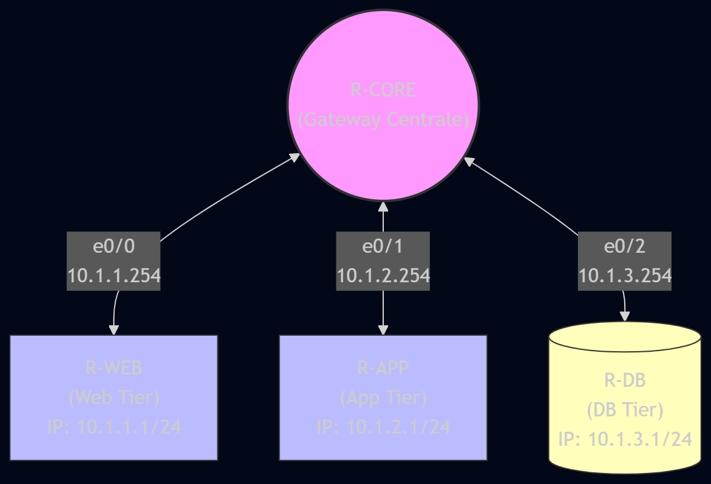

# LAB: Architettura 3-Tier Zero Trust con ACL

## Descrizione
Questo laboratorio pratico dimostra come implementare un'architettura di rete a tre livelli (Web, Application, Database) basata sui principi fondamentali di Zero Trust. Attraverso l'uso di un router centrale (R-CORE) che funge da gateway per i tre segmenti isolati, vengono applicate rigorose Access Control List (ACL) per imporre un approccio "default deny".

Il traffico di rete è strettamente limitato per ridurre la superficie di attacco:
- Il livello **Web** può comunicare esclusivamente con il livello **App**.
- Il livello **App** funge da intermediario e può comunicare sia con il livello **Web** che con il livello **DB**.
- Il livello **DB** non è autorizzato a iniziare alcuna sessione di rete, ma può unicamente rispondere alle interrogazioni provenienti dal livello **App**.

## Immagini Utilizzate (PNETLab)
Per l'esecuzione di questo laboratorio sono necessari i seguenti nodi:
- **4x Nodi Cisco IOL (IOS on Linux) L3**: Immagini di routing standard (es. `i86bi-linux-l3-adventerprisek9-15.4.2T.bin` o equivalenti). Le interfacce utilizzate sono Ethernet da `e0/0` a `e0/2`.

## Tabella Indirizzamento e Cablaggio

| Dispositivo | Interfaccia | Destinazione | Indirizzo IP | Subnet Mask | Gateway |
| :--- | :--- | :--- | :--- | :--- | :--- |
| **R-CORE** | e0/0 | R-WEB (e0/0) | 10.1.1.254 | 255.255.255.0 | - |
| **R-CORE** | e0/1 | R-APP (e0/0) | 10.1.2.254 | 255.255.255.0 | - |
| **R-CORE** | e0/2 | R-DB (e0/0) | 10.1.3.254 | 255.255.255.0 | - |
| **R-WEB** | e0/0 | R-CORE (e0/0) | 10.1.1.1 | 255.255.255.0 | 10.1.1.254 |
| **R-APP** | e0/0 | R-CORE (e0/1) | 10.1.2.1 | 255.255.255.0 | 10.1.2.254 |
| **R-DB** | e0/0 | R-CORE (e0/2) | 10.1.3.1 | 255.255.255.0 | 10.1.3.254 |

## Configurazione
Seguire gli step di configurazione descritti nel workbook per il setup iniziale degli IP e per la successiva applicazione delle ACL `ACL_WEB_IN`, `ACL_APP_IN` e `ACL_DB_IN` sulle interfacce di R-CORE.

## Network Diagram

