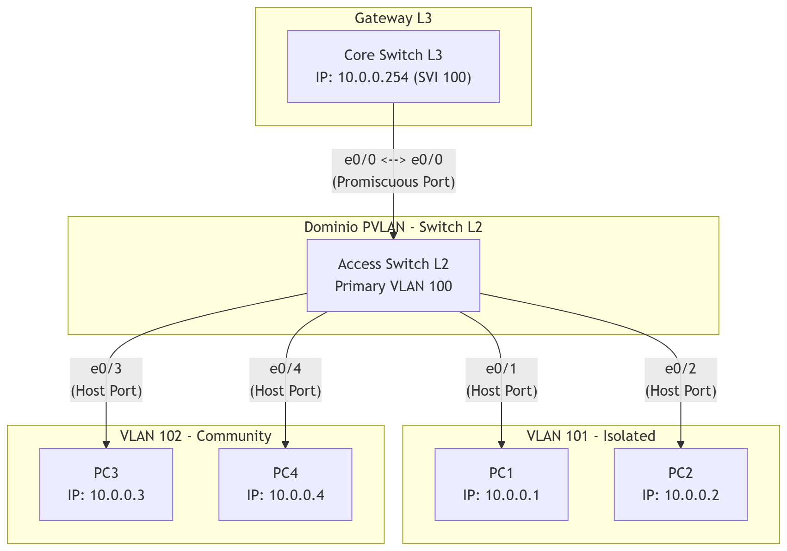

# Workbook: Configurazione Private VLAN (PVLAN) su Cisco IOL

## 1. Scenario
In questo laboratorio simuleremo una rete in cui è necessario applicare una rigida segregazione del traffico a Livello 2, mantenendo però tutti i dispositivi sulla stessa sottorete IP (Livello 3).
* **Switch Core (L3):** Agisce da default gateway per la rete.
* **Switch Access (L2):** Dispositivo su cui verranno configurate le policy PVLAN.
* **Host PC1/PC2:** Inseriti in una VLAN Isolata (non comunicano tra loro).
* **Host PC3/PC4:** Inseriti in una VLAN Community (comunicano tra loro ma non con altre VLAN).

**Punto Critico:** L'isolamento a livello L2 richiede l'impostazione dello switch in modalità VTP Transparent. È fondamentale configurare correttamente la porta **Promiscuous** per permettere a tutti gli host isolati e in community di raggiungere il gateway condiviso senza infrangere le regole di sicurezza L2.

---

## 2. Diagramma di Rete
Di seguito lo schema logico e fisico del laboratorio:

---

## 3. Topologia e Connessioni
Le connessioni fisiche (IOL Interfaces) sono definite come segue:

| Device Locale | Porta Locale | Device Remoto | Porta Remota | Ruolo Porta | Descrizione |
| :--- | :--- | :--- | :--- | :--- | :--- |
| **Access L2** | e0/0 | **Core L3** | e0/0 | Promiscuous | Uplink verso il Gateway |
| **Access L2** | e0/1 | **PC1** | e0/0 | Host (Isolated) | Nodo isolato |
| **Access L2** | e0/2 | **PC2** | e0/0 | Host (Isolated) | Nodo isolato |
| **Access L2** | e0/3 | **PC3** | e0/0 | Host (Community)| Nodo in community |
| **Access L2** | e0/4 | **PC4** | e0/0 | Host (Community)| Nodo in community |

---

## 4. Tabella Indirizzamento IP
Tutti i dispositivi si trovano all'interno della stessa sottorete logica L3 (`10.0.0.0/24`).

| Device | Interface | IP Address | Subnet Mask | Default Gateway | VLAN Logica |
| :--- | :--- | :--- | :--- | :--- | :--- |
| **Core L3** | e0/0 | 10.0.0.254 | /24 | N/A | 100 (Primary) |
| **PC1** | e0/0 | 10.0.0.1 | /24 | 10.0.0.254 | 101 (Isolated) |
| **PC2** | e0/0 | 10.0.0.2 | /24 | 10.0.0.254 | 101 (Isolated) |
| **PC3** | e0/0 | 10.0.0.3 | /24 | 10.0.0.254 | 102 (Community) |
| **PC4** | e0/0 | 10.0.0.4 | /24 | 10.0.0.254 | 102 (Community) |

---

## 5. Lab Tasks (Obiettivi)

### Task 1: Preparazione e Creazione VLAN (Access L2)
1. Impostare lo switch L2 in modalità **VTP Transparent**.
2. Creare la VLAN 101 come `isolated`.
3. Creare la VLAN 102 come `community`.
4. Creare la VLAN 100 come `primary` e associarle le VLAN 101 e 102.

### Task 2: Configurazione Porte di Accesso (Access L2)
1. Configurare le porte `e0/1` ed `e0/2` (PC1 e PC2) come host PVLAN e mapparle alla coppia 100-101 (Primary-Isolated).
2. Configurare le porte `e0/3` ed `e0/4` (PC3 e PC4) come host PVLAN e mapparle alla coppia 100-102 (Primary-Community).

### Task 3: Configurazione Uplink e Gateway
1. Configurare la porta `e0/0` sullo switch L2 come `promiscuous` e mappare la VLAN primaria 100 alle secondarie 101 e 102.
2. Sul **Core L3**, configurare l'interfaccia `e0/0` con l'IP `10.0.0.254/24` e abilitare la porta.

### Task 4: Verifica dell'Isolamento
1. Effettuare un ping da PC1 verso PC2: **Deve fallire** (Isolamento L2).
2. Effettuare un ping da PC3 verso PC4: **Deve avere successo** (Stessa Community).
3. Effettuare un ping da PC1 verso PC3: **Deve fallire** (Cross-VLAN).
4. Effettuare un ping da qualsiasi PC verso 10.0.0.254: **Deve avere successo** (Raggiungibilità del Gateway).
