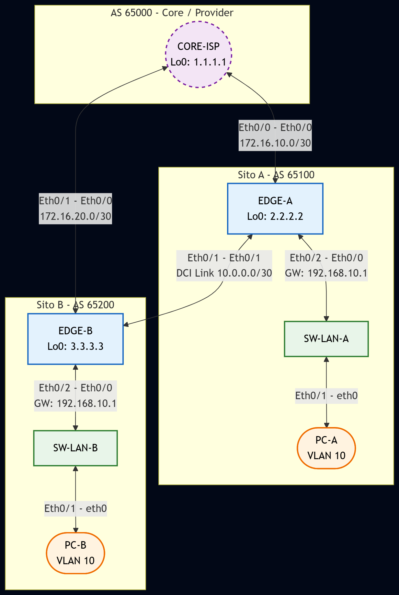

# Laboratorio Design Resilienza e Disaster Recovery IPv4 (Multi-Site)

Questo repository contiene un laboratorio di design avanzato focalizzato sulla resilienza e l'ottimizzazione dei percorsi in uno scenario Multi-Site. L'obiettivo non è solo la connettività, ma il controllo deterministico del traffico in caso di guasti e la prevenzione del sub-optimal routing.

## 🎯 Obiettivo del Laboratorio

Il laboratorio simula due Data Center (Sito A e Sito B) interconnessi tramite un link DCI e collegati a un CoreInternet condiviso.

In questo scenario, approfondiremo
 Inbound Traffic Engineering Utilizzo di AS-Path Prepending e MED per influenzare l'ingresso del traffico.
 Outbound Path Selection Gestione della Local Preference per evitare la saturazione del link DCI.
 Resilienza Multi-Homing Configurazione di BGP Conditional Advertisement per scenari di failover.
 Anycast Gateway Design Implementazione di gateway ridondati per la mobilità dei carichi di lavoro tra siti.

## 🛠️ Prerequisiti

 Piattaforma PNetLab  EVE-NG  GNS3
 Immagini
     Cisco vIOS-L3 (Ottimizzata per 512MB RAM) per Edge e Core.
     Cisco vIOS-L2 per la parte di accessoDCI.
     VPCS o Linux TinyCore per i test di raggiungibilità.

## 🏗️ Topologia e Ruoli

L'infrastruttura è suddivisa in tre domini principali

1.  ISPCORE (AS 65000) Simula il provider internet o il backbone aziendale che riceve le rotte dai due siti.
2.  SITO-A (AS 65100) Sito primario per le applicazioni critiche.
3.  SITO-B (AS 65200) Sito di Disaster Recovery.
4.  DCI LINK Connessione diretta tra i due siti per il traffico inter-site e backup.

---

## 🗺️ Tabelle del Laboratorio

### Tabella di Cablaggio (Cabling)

 Da Dispositivo  Interfaccia  A Dispositivo  Interfaccia  Note 
 ---  ---  ---  ---  --- 
 EDGE-A  Gi00  CORE-ISP  Gi00  Link Primario Sito A 
 EDGE-A  Gi01  EDGE-B  Gi01  Link DCI (Data Center Interconnect) 
 EDGE-B  Gi00  CORE-ISP  Gi01  Link Primario Sito B 
 EDGE-A  Gi02  SW-LAN-A  Gi00  Connessione LAN Interna A 
 EDGE-B  Gi02  SW-LAN-B  Gi00  Connessione LAN Interna B 

### Tabella Indirizzamento IP (IPv4)

 Dispositivo  Interfaccia  Indirizzo IP  Subnet Mask  Ruolo  Note 
 ---  ---  ---  ---  --- 
 CORE-ISP  Loopback0  `1.1.1.1`  `255.255.255.255`  Router ID ISP 
 EDGE-A  Loopback0  `2.2.2.2`  `255.255.255.255`  Router ID Edge A 
 EDGE-B  Loopback0  `3.3.3.3`  `255.255.255.255`  Router ID Edge B 
 Link A-ISP  Gi00 - Gi00  `172.16.10.0`  `255.255.255.252`  Peering BGP Sito A 
 Link B-ISP  Gi00 - Gi01  `172.16.20.0`  `255.255.255.252`  Peering BGP Sito B 
 Link DCI  Gi01 - Gi01  `10.0.0.0`  `255.255.255.252`  Inter-Site Link 
 Sito A LAN  VLAN 10  `192.168.10.1`  `255.255.255.0`  Gateway Anycast (Sito A) 
 Sito B LAN  VLAN 10  `192.168.10.1`  `255.255.255.0`  Gateway Anycast (Sito B) 

---

## 🚀 Scenari di Test

1.  Stato Nominale Verificare che il Sito A esca tramite il proprio ISP e il Sito B tramite il proprio.
2.  Failover ISP A Spegnere Gi00 su EDGE-A e verificare che il traffico usi il link DCI per uscire tramite EDGE-B.
3.  Ottimizzazione MED Configurare il CORE-ISP affinché preferisca il Sito A per la subnet 192.168.10.024 in condizioni normali.

## Network Diagram

