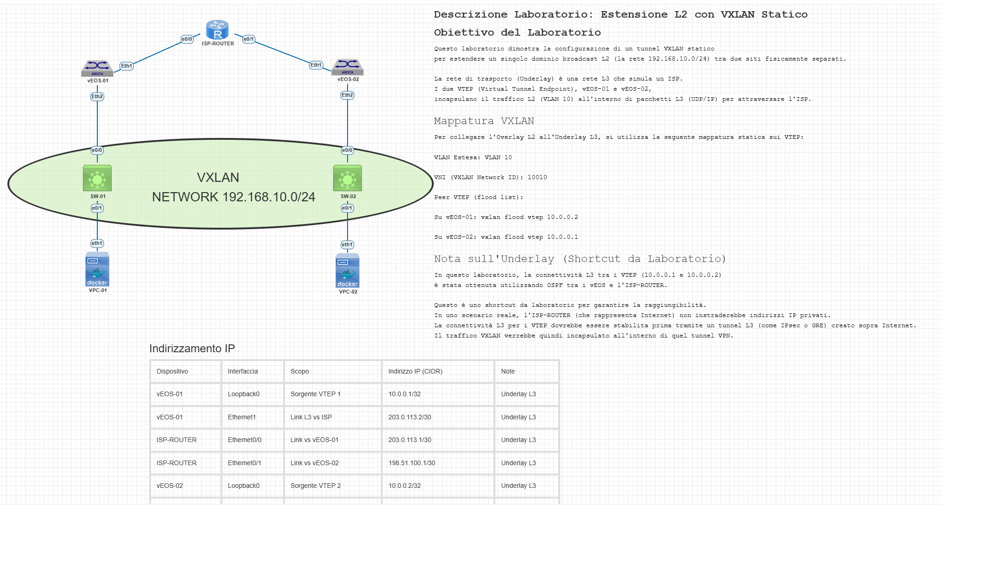

# Laboratorio: Estensione L2 con VXLAN Statico (PNETLAB)

## 🎯 Obiettivo del Laboratorio

Questo laboratorio PNETLAB/EVE-NG dimostra la configurazione di un **tunnel VXLAN statico** per estendere un singolo dominio broadcast L2 (VLAN 10) attraverso una rete L3 (simulando un ISP).

## 🔬 Descrizione del Lab

L'obiettivo è permettere a due host (VPC-01, VPC-02), situati in siti fisici diversi, di comunicare nella stessa subnet IP (`192.168.10.0/24`) come se fossero collegati allo stesso switch.

I VTEP (Virtual Tunnel Endpoint), `vEOS-01` e `vEOS-02` (Arista vEOS), incapsulano il traffico L2 (VLAN 10) all'interno di pacchetti L3 (UDP/IP) per attraversare l'ISP.

Il test finale prevede che `VPC-02` (sito remoto) ottenga un indirizzo IP dal server DHCP `SW-01` (sito locale), dimostrando il trasporto di broadcast L2 sul tunnel L3.

### Nota sull'Underlay (Shortcut da Laboratorio)

In questo laboratorio, la connettività L3 tra i VTEP (`10.0.0.1` e `10.0.0.2`) è stata ottenuta **utilizzando OSPF** tra i `vEOS` e l'`ISP-ROUTER`.

Questo è uno **shortcut da laboratorio** per garantire la raggiungibilità. In uno scenario reale, l'ISP-ROUTER (che rappresenta Internet) **non** instraderebbe indirizzi IP privati. La connettività L3 per i VTEP dovrebbe essere stabilita *prima* tramite un tunnel L3 (come **IPsec** o **GRE**) creato sopra Internet.

---

## Diagramma della Topologia



---

## ⚙️ Mappatura VXLAN

* **VLAN Estesa:** `10`
* **VNI (VXLAN Network ID):** `10010`
* **Peer VTEP (flood list):**
    * Su `vEOS-01`: `vxlan flood vtep 10.0.0.2`
    * Su `vEOS-02`: `vxlan flood vtep 10.0.0.1`

## 📋 Pianificazione Indirizzamento IP

| Dispositivo | Interfaccia | Scopo | Indirizzo IP (CIDR) | Note |
| :--- | :--- | :--- | :--- | :--- |
| **vEOS-01** | `Loopback0` | **Sorgente VTEP 1** | **`10.0.0.1/32`** | Underlay L3 |
| **vEOS-01** | `Ethernet1` | Link L3 vs ISP | `203.0.113.2/30` | Underlay L3 |
| **ISP-ROUTER**| `Ethernet0/0`| Link vs vEOS-01 | `203.0.113.1/30` | Underlay L3 |
| **ISP-ROUTER**| `Ethernet0/1`| Link vs vEOS-02 | `198.51.100.1/30` | Underlay L3 |
| **vEOS-02** | `Loopback0` | **Sorgente VTEP 2** | **`10.0.0.2/32`** | Underlay L3 |
| **vEOS-02** | `Ethernet1` | Link L3 vs ISP | `198.51.100.2/30` | Underlay L3 |
| **SW-01** | `Vlan10` | **Gateway LAN Clienti** | **`192.168.10.1/24`** | Overlay L2 |
| **VPC-01** | `eth1` | Client LAN (Sito 1) | `DHCP (da 192.168.10.x)` | Overlay L2 |
| **VPC-02** | `eth1` | Client LAN (Sito 2) | `DHCP (da 192.168.10.x)` | Overlay L2 |

## ✅ Verifica Finale

Dopo aver applicato le configurazioni, i test principali sono:

1.  **Connettività Underlay:** Da `vEOS-01`, `ping 10.0.0.2 source 10.0.0.1`. (Deve funzionare).
2.  **Test DHCP:** `VPC-02` (remoto) deve ottenere un IP da `SW-01`.
3.  **Test Overlay:** `ping` tra `VPC-01` e `VPC-02`.

### Comandi di Verifica VTEP

Sui `vEOS`, usare questi comandi per il troubleshooting:

```bash
show interfaces Vxlan1
show vxlan vni
show mac address-table
```
(L'ultimo comando dovrebbe mostrare i MAC remoti imparati sull'interfaccia `Vx1`).