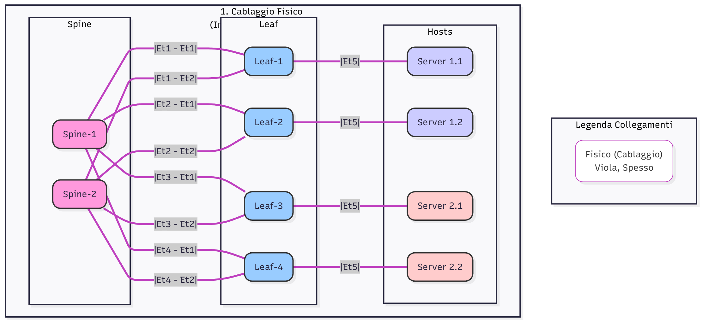
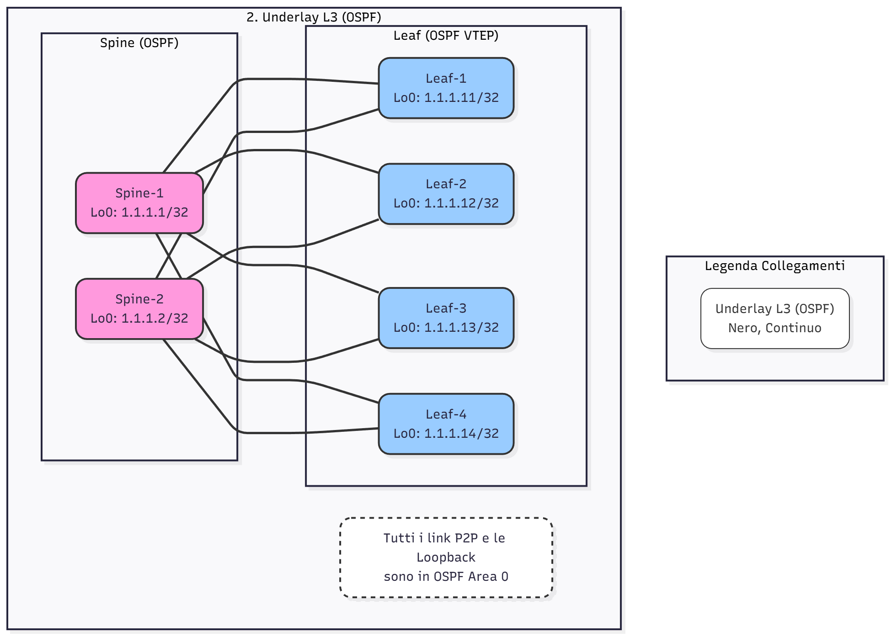
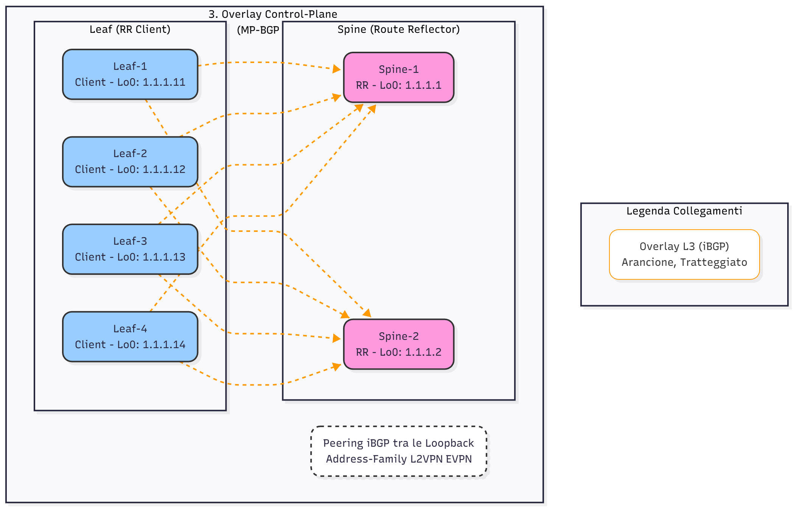
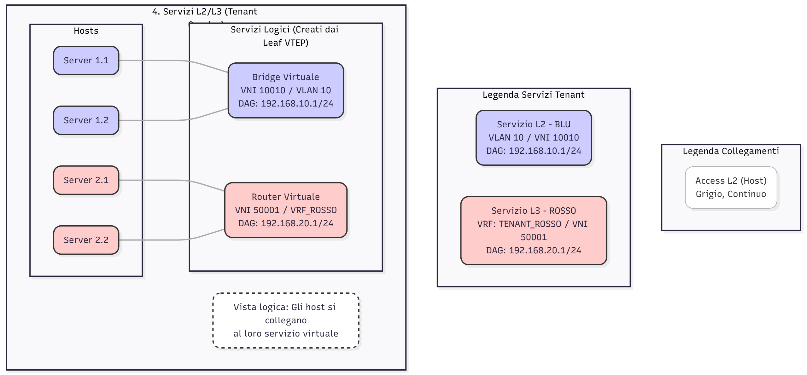

# LAB: Fabric Datacenter Greenfield con MP-BGP EVPN

Questo laboratorio costruisce un moderno datacenter "Greenfield" utilizzando una fabric L3 Spine-Leaf (Clos) e implementa un overlay **VXLAN dinamico** gestito da un control-plane **MP-BGP EVPN**.

Questo scenario rappresenta l'evoluzione del laboratorio precedente ("LAB: Integrazione Brownfield-Greenfield"), focalizzandosi sulla creazione di una fabric overlay multi-tenant scalabile, partendo da una rete L3 "underlay".

## 🎯 Obiettivo del Laboratorio

L'obiettivo è progettare e validare una fabric VXLAN EVPN in grado di fornire servizi di rete agili e scalabili all'interno di un singolo datacenter, tra cui:

* Costruire un **Underlay L3** stabile e scalabile (basato su OSPF).
* Implementare un **Overlay L2** (estensione VLAN) utilizzando BGP EVPN per scoprire dinamicamente i VTEP.
* Implementare un **Overlay L3** (VRF) per la segmentazione dei tenant.
* Validare il **Distributed Anycast Gateway (DAG)**, dove ogni switch Leaf funge da gateway di default per i suoi host.
* Comprendere l'interazione tra l'Underlay (trasporto) e l'Overlay (servizio).

## 🛠️ Prerequisiti

* **Immagini PNetLab:** **Arista vEOS** (v4.23.0F o successiva consigliata).
* **Topologia:** 2x Spine, 4x Leaf, 4x Host (vPCS o IOL-L2).

## ⚠️ Setup Importante: Disabilitare Zero Touch Provisioning (ZTP)

Prima di iniziare qualsiasi configurazione, è **fondamentale** disabilitare ZTP su **tutti** gli switch Arista vEOS (Spine e Leaf).

Appena avviato il dispositivo, accedere alla console ed eseguire:

1.  Entrare in modalità enable: `enable` (non è richiesta password)
2.  Eseguire il comando: `zerotouch disable`
3.  Salvare la modifica: `write`
4.  Ricaricare il dispositivo: `reload`

Il dispositivo si riavvierà. Dopo il riavvio, ZTP sarà disabilitato e sarà possibile procedere con la configurazione manuale.

## 🏛️ Architettura di Rete

La topologia è un classico design Spine-Leaf:

1.  **Underlay (Rete di Trasporto):**
    * 2x Switch Spine (Arista vEOS).
    * 4x Switch Leaf (Arista vEOS).
    * Tutte le connessioni tra Spine e Leaf sono link L3 (point-to-point).
    * Un protocollo di routing (OSPF) viene eseguito per garantire la connettività IP completa tra le interfacce di **Loopback 0** di tutti gli switch Leaf e Spine.
    * Le interfacce di Loopback 0 dei Leaf saranno usate come origine dei Tunnel VXLAN (VTEP).

2.  **Overlay (Control Plane):**
    * Viene stabilita una sessione **MP-BGP (iBGP)** tra tutti gli switch Leaf e gli Spine.
    * Gli Spine agiscono come **Route-Reflector** per la address-family `l2vpn evpn`.
    * I Leaf (VTEP) si annunciano e scoprono a vicenda dinamicamente tramite BGP, eliminando la necessità di configurare la Head-End Replication statica.

3.  **Servizi Overlay (Data Plane):**
    * **VNI L2 (Tenant BLU):** Una VLAN (es. VLAN 10) viene mappata a una VNI (es. 10010). Gli host collegati ai diversi Leaf in questa VLAN possono comunicare come se fossero sullo stesso switch L2.
    * **VNI L3 (Tenant ROSSO):** Un VRF (es. "TENANT_ROSSO") viene mappato a una VNI L3 (es. 50001). Questo crea un dominio di routing L3 completamente separato sulla fabric.
    * **Gateway:** Per ogni VLAN/VNI, ogni Leaf configura la stessa identica interfaccia SVI (es. `int Vlan 10`, `ip address 192.168.10.1/24`) che funge da **Distributed Anycast Gateway**.

## 🛠️ Tecnologie Chiave Verificate

* **Underlay:** OSPF (per connettività VTEP).
* **Overlay Control-Plane:** MP-BGP, Address-Family `l2vpn evpn`, Route Reflectors.
* **Overlay Data-Plane:** VXLAN (dinamico).
* **Segmentazione L2:** EVPN Type-2 Routes (MAC/IP advertisement).
* **Segmentazione L3:** EVPN Type-5 Routes (IP Prefix advertisement) e VRF Lite.
* **Gateway:** Distributed Anycast Gateway (DAG).

## 📁 Contenuto del Repository

* **README.md:** Questo file.
* **Workbook.md:** Istruzioni passo-passo e comandi di verifica.
* **Diagram_01_Fisico.png:** Diagramma del cablaggio fisico.
* **Diagram_02_Underlay_OSPF.png:** Diagramma della rete di trasporto L3 OSPF.
* **Diagram_03_Overlay_BGP.png:** Diagramma del control plane BGP EVPN.
* **Diagram_04_Servizi_Tenant.png:** Diagramma logico dei servizi tenant.
* **Mermaid_Codes/:** Codici sorgente per tutti i diagrammi.
* **Configs/:** Le configurazioni finali per ogni dispositivo.

---

## 🗺️ Diagrammi di Rete

### Schema 1: Cablaggio Fisico (Layer 1)

Mostra la topologia fisica Spine-Leaf e la connessione degli host, incluse le interfacce Arista.

### Schema 2: Underlay L3 (OSPF)

Mostra la rete di trasporto L3 (connettività IP e OSPF) che fornisce raggiungibilità tra i VTEP (Loopback dei Leaf).

### Schema 3: Overlay Control Plane (MP-BGP EVPN)

Mostra le sessioni iBGP logiche (AF L2VPN EVPN) tra i Leaf (Client) e gli Spine (Route Reflector) per lo scambio delle informazioni sui VTEP e sugli host.

### Schema 4: Servizi L2/L3 (Tenant Overlay)

Mostra la vista logica finale dal punto di vista dei tenant, astraendo la fabric fisica. Illustra come i servizi (Bridge L2 e Router L3) vengono consegnati agli host.

