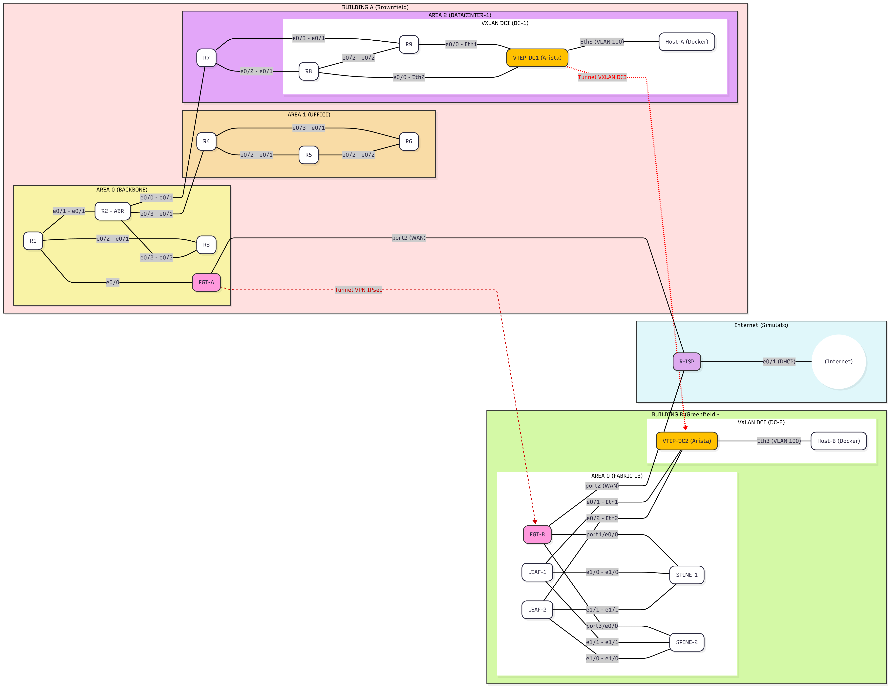

# LAB: Integrazione Brownfield-Greenfield con DCI VXLAN

Questo repository documenta un laboratorio di rete avanzato che simula uno scenario di design aziendale complesso: l'integrazione di un sito esistente ("Brownfield") con un nuovo datacenter ("Greenfield") e l'estensione della connettività Layer 2 tra di loro.

Il laboratorio è costruito interamente su PNetLab utilizzando una combinazione di IOL (Cisco IOS), Arista vEOS e FortiGate.

## 🎯 Obiettivo del Laboratorio

L'obiettivo è progettare e validare un'architettura di rete multi-sito, sicura e ridondata, in grado di:
* Collegare in modo sicuro due siti (Datacenter) attraverso Internet.
* Costruire un moderno datacenter greenfield utilizzando una fabric L3 Spine-Leaf.
* Implementare un DCI (Data Center Interconnect) per estendere un dominio L2 (VLAN) tra i due siti attraverso la rete L3.

## 🏛️ Architettura di Rete

La topologia è suddivisa in tre componenti principali:

1.  **BUILDING A (Sito Brownfield):** Un sito esistente che esegue una rete OSPF multi-area (Area 0, 1, 2) che funge da nostro Datacenter-1. Questa rete è stata creata nel laboratorio precedente: **"LAB_ Design OSPF Scalabile_Single-Area_vs. Multi-Area"**.
2.  **BUILDING B (Sito Greenfield):** Un nuovo Datacenter-2 costruito da zero con un design L3 Spine-Leaf (OSPF-based) per la massima scalabilità e ridondanza (ECMP).
3.  **WAN / INTERNET:** Un'area di transito che utilizza FortiGate su entrambi i siti per stabilire un **Tunnel VPN IPsec S2S** e fornire accesso Internet (NAT/PAT).

L'obiettivo finale è raggiunto estendendo la **VLAN 100** dal DC-1 al DC-2 utilizzando un **Tunnel VXLAN** che viaggia *all'interno* del tunnel VPN IPsec.

## 🛠️ Tecnologie Chiave Verificate

* **Routing (Underlay):** OSPF Multi-Area, OSPF Single-Area (nella fabric L3), `default-information originate` per la distribuzione della rotta di default.
* **Sicurezza:** FortiGate Firewall, policy, NAT e VPN IPsec Site-to-Site (Route-Based).
* **Datacenter Fabric:** L3 Spine-Leaf (Clos) con OSPF e ridondanza ECMP.
* **Overlay (DCI):** VXLAN statico (Head-End Replication) per l'estensione L2 tra siti (VNI 10100).
* **Ridondanza:** Test di failover dei link della fabric e dei link verso i firewall.

## 📁 Contenuto del Repository

* **README.md:** Questo file.
* **Workbook.md:** Istruzioni passo-passo, piano di indirizzamento e comandi di verifica (in arrivo).
* **Diagram_Mermaid.png:** Il diagramma di rete completo.
* **Configs/:** Le configurazioni complete per ogni dispositivo (Router, Switch, Firewall).

---

## 🗺️ Diagramma di Rete

