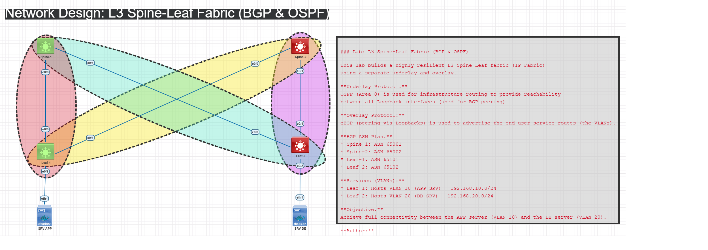

### Network Design: L3 Spine-Leaf Fabric (BGP & OSPF)

This lab builds a highly resilient L3 Spine-Leaf fabric (IP Fabric) using a separate underlay and overlay.

**Underlay Protocol:**
OSPF (Area 0) is used for infrastructure routing to provide reachability between all Loopback interfaces (used for BGP peering).

**Overlay Protocol:**
eBGP (peering via Loopbacks) is used to advertise the end-user service routes (the VLANs).

**BGP ASN Plan:**
* Spine-1: ASN 65001
* Spine-2: ASN 65002
* Leaf-1: ASN 65101
* Leaf-2: ASN 65102

**Services (VLANs):**
* Leaf-1: Hosts VLAN 10 (APP-SRV) - 192.168.10.0/24
* Leaf-2: Hosts VLAN 20 (DB-SRV) - 192.168.20.0/24

**Objective:**
Achieve full connectivity between the APP server (VLAN 10) and the DB server (VLAN 20).

**Author:**
DAVID AULICINO

