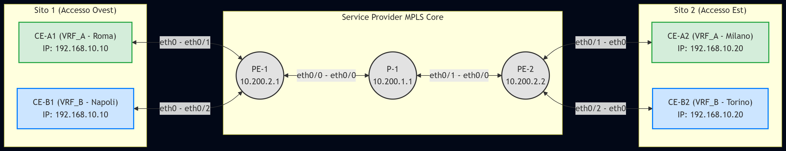

# Network Design: MPLS L3VPN Multi-Tenant (OSPF, LDP & MP-BGP)

> **Autori:** MAX & Blancc  
> **Livello:** Intermedio / Avanzato  
> **Simulatore:** EVE-NG / GNS3 con immagini Cisco IOL L3

---

## Descrizione del Laboratorio

Questo laboratorio costruisce un'infrastruttura **Service Provider Core** scalabile che fornisce servizi di connettività isolati tramite VRF (Virtual Routing and Forwarding). L'obiettivo didattico è comprendere, configurare e verificare una rete MPLS L3VPN completa, dalla distribuzione delle label nel core fino all'isolamento del traffico tra clienti distinti.

---

## Architettura a Tre Livelli

La rete è organizzata su tre livelli logici distinti:

### 1. Underlay (Core Fisico - Livello IGP/LDP)
OSPF (Area 0) fornisce il routing dell'infrastruttura e garantisce la raggiungibilità tra le interfacce Loopback dei nodi Provider. LDP (Label Distribution Protocol) distribuisce le etichette di trasporto MPLS attraverso il core, costruendo il piano di forwarding in base alle rotte apprese da OSPF.

### 2. Overlay (Control Plane VPN - Livello MP-BGP)
MP-BGP con peering iBGP via Loopback è il protocollo di controllo dell'overlay VPN. Utilizza l'address-family **VPNv4** per annunciare le rotte dei clienti complete di Route Distinguisher (RD) e Label VPN, mantenendo separate le informazioni di routing di ciascun cliente.

### 3. Accesso Cliente (PE-CE - Routing Statico)
Il routing tra i PE (Provider Edge) e i CE (Customer Edge) è implementato tramite **route statiche per VRF**, ridistribuite poi in MP-BGP. Questa scelta semplifica il laboratorio pur mantenendo la corretta segregazione delle tabelle di routing.

---

## Piano VRF (Tenant)

| Cliente | VRF | Route Distinguisher | Route Target Import | Route Target Export |
|---------|-----|--------------------|--------------------|---------------------|
| Cliente A | VRF_A | 100:1 | 100:1 | 100:1 |
| Cliente B | VRF_B | 200:1 | 200:1 | 200:1 |

> **Nota:** RD e RT distinti per ogni cliente garantiscono l'isolamento delle tabelle VPNv4 nel control plane BGP.

---

## Piano di Indirizzamento

### Infrastruttura SP Core

| Dispositivo | Interfaccia | IP / Mask | Scopo |
|-------------|-------------|-----------|-------|
| P-1 | Loopback0 | 10.200.1.1/32 | Router-ID, OSPF, LDP |
| P-1 | Ethernet0/0 | 10.100.1.1/30 | Link P2P verso PE-1 |
| P-1 | Ethernet0/1 | 10.100.2.1/30 | Link P2P verso PE-2 |
| PE-1 | Loopback0 | 10.200.2.1/32 | Router-ID, iBGP Peering |
| PE-1 | Ethernet0/0 | 10.100.1.2/30 | Link Underlay verso P-1 |
| PE-2 | Loopback0 | 10.200.2.2/32 | Router-ID, iBGP Peering |
| PE-2 | Ethernet0/0 | 10.100.2.2/30 | Link Underlay verso P-1 |

### Accesso Clienti (VRF)

| Dispositivo | Interfaccia | IP / Mask | VRF | Sito |
|-------------|-------------|-----------|-----|------|
| PE-1 | Ethernet0/1 | 192.168.10.254/24 | VRF_A | Gateway Roma |
| PE-1 | Ethernet0/2 | 192.168.10.254/24 | VRF_B | Gateway Napoli |
| PE-2 | Ethernet0/1 | 192.168.10.254/24 | VRF_A | Gateway Milano |
| PE-2 | Ethernet0/2 | 192.168.10.254/24 | VRF_B | Gateway Torino |
| CE-A1 | eth0 | 192.168.10.10/24 | — | Cliente A, Roma |
| CE-A2 | eth0 | 192.168.10.20/24 | — | Cliente A, Milano |
| CE-B1 | eth0 | 192.168.10.10/24 | — | Cliente B, Napoli |
| CE-B2 | eth0 | 192.168.10.20/24 | — | Cliente B, Torino |

> **Overlapping IP intenzionale:** CE-A1 e CE-B1 condividono lo stesso indirizzo IP 192.168.10.10. Questo dimostra che le VRF mantengono tabelle di routing completamente separate, rendendo possibile l'overlap senza conflitti.

---

## Cablaggio Fisico

| Da | Interfaccia | A | Interfaccia | Scopo |
|----|-------------|---|-------------|-------|
| PE-1 | eth0/0 | P-1 | eth0/0 | Link Underlay SP |
| PE-2 | eth0/0 | P-1 | eth0/1 | Link Underlay SP |
| CE-A1 | eth0 | PE-1 | eth0/1 | Accesso VRF_A Sito 1 |
| CE-B1 | eth0 | PE-1 | eth0/2 | Accesso VRF_B Sito 1 |
| CE-A2 | eth0 | PE-2 | eth0/1 | Accesso VRF_A Sito 2 |
| CE-B2 | eth0 | PE-2 | eth0/2 | Accesso VRF_B Sito 2 |

---

## Stack Protocollare

```
┌─────────────────────────────────────────────┐
│         LIVELLO 3 - PE-CE Routing           │
│      Route Statiche per VRF → BGP Redist.   │
├─────────────────────────────────────────────┤
│         LIVELLO 2 - Overlay VPN             │
│    MP-BGP iBGP / Address-Family VPNv4       │
│    Route Distinguisher + VPN Label          │
├─────────────────────────────────────────────┤
│         LIVELLO 1 - Underlay Core           │
│    OSPF Area 0 (IGP) + LDP (Labels)         │
│    Transport Label per Loopback PE          │
└─────────────────────────────────────────────┘
```

---

## Obiettivi di Verifica

1. **Connettività Intranet:** `CE-A1 → CE-A2` e `CE-B1 → CE-B2` devono comunicare con successo.
2. **Isolamento tra VRF:** Un ping da `CE-A1` verso la rete del Cliente B non deve avere esito positivo.
3. **Overlap IP senza conflitti:** `CE-A1` e `CE-B1` con lo stesso IP devono coesistere su PE-1 senza problemi.
4. **Verifica Label MPLS:** Un traceroute da `CE-A1` a `CE-A2` deve mostrare le etichette MPLS sul router P-1 (doppia label: Transport + VPN).

---

## Bill of Materials (BoM)

| Qty | Tipo | Ruolo | Nome |
|-----|------|-------|------|
| 2 | Cisco IOL L3 | Provider Edge (PE) | PE-1, PE-2 |
| 1 | Cisco IOL L3 | Provider Core (P) | P-1 |
| 4 | VPCS | Customer Edge (Endpoint) | CE-A1, CE-A2, CE-B1, CE-B2 |

---

## Diagramma di Rete



---

## Concetti Chiave da Padroneggiare

- **VRF (Virtual Routing and Forwarding):** Istanze di routing virtuali e isolate su un singolo router fisico.
- **Route Distinguisher (RD):** Campo a 64 bit che rende univoco un prefisso IPv4 nel piano di controllo BGP VPNv4, anche se sovrapposto con altri clienti.
- **Route Target (RT):** Community BGP estesa che controlla quali prefissi VPN vengono importati/esportati da una VRF — il meccanismo che realizza l'isolamento o la condivisione selettiva tra VPN.
- **LDP:** Protocollo di distribuzione delle label di trasporto, strettamente accoppiato con OSPF per costruire il Label Switching Path (LSP) end-to-end tra i PE.
- **Doppia label MPLS (Label Stack):** Nel core MPLS L3VPN transitano due label: quella esterna (Transport Label, assegnata da LDP) e quella interna (VPN Label, assegnata da MP-BGP). Il router P-1 commuta solo la label esterna, senza dover conoscere le VRF dei clienti.
- **Penultimate Hop Popping (PHP):** Il router P-1 rimuove la label di trasporto prima di consegnare il pacchetto al PE di destinazione, riducendo il carico di elaborazione sull'egress PE.
