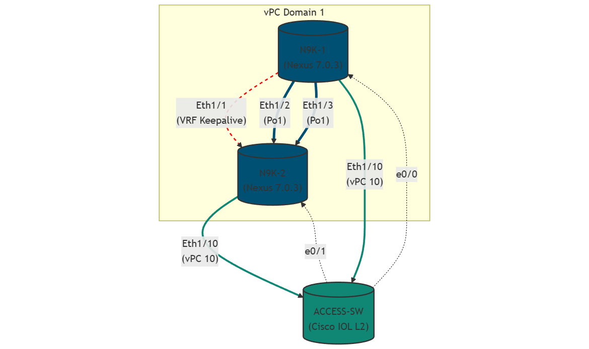

# LAB: Nexus vPC Domain Setup with LACP

## Descrizione del Progetto
Questo laboratorio ha lo scopo di implementare un dominio **vPC (virtual Port Channel)** utilizzando Cisco Nexus (NX-OS).
Lo scenario replica una configurazione standard da Data Center in cui due switch Core/Aggregation (Nexus 9000) lavorano come una singola entità logica per fornire ridondanza attiva-attiva verso uno switch di Accesso, eliminando la necessità di Spanning Tree Protocol (STP) sui link di uplink.

Il laboratorio è stato ottimizzato per ambienti con risorse limitate (Server Pnetlab con 8GB RAM), utilizzando le immagini **Nexus 9000v Titanium (7.0.3)** e **Cisco IOL L2**.

## Obiettivi Didattici
* Comprendere la sintassi **NX-OS** (Feature activation, Checkpoint, VRF).
* Configurare un collegamento **Peer-Keepalive** isolato in una VRF dedicata.
* Configurare il **vPC Peer-Link** per la sincronizzazione del control plane.
* Creare un **vPC Member Port** verso uno switch di accesso.
* Configurare **LACP** (Link Aggregation Control Protocol) in scenario cross-chassis.
* Verificare la consistenza dei parametri (Type-1 e Type-2 inconsistencies).

## Topologia e Risorse
* **Piattaforma:** Pnetlab / EVE-NG
* **Immagini Utilizzate:**
    * **Core:** 2x Cisco Nexus 9000v (Versione 7.0.3 Titanium - ID 993) - *Allocazione RAM: 3072MB/nodo*.
    * **Access:** 1x Cisco IOL L2 (i86bi-linux-l2-adventerprise-15.2) - *Allocazione RAM: 256MB*.

## Prerequisiti
* Conoscenza base dei concetti di Etherchannel/LACP su Cisco IOS.
* Server di virtualizzazione con almeno 6.5GB di RAM libera.
* Pazienza: Le immagini Nexus 7.x richiedono 5-10 minuti per il boot completo.

## Struttura della Configurazione
1.  **Feature Enablement:** Attivazione plugin software (vpc, lacp).
2.  **Keepalive Link:** Configurazione Layer 3 dedicata.
3.  **vPC Domain:** Definizione ruoli (Primary/Secondary) e parametri di sistema.
4.  **Peer-Link:** Trunking ad alta capacità tra i peer.
5.  **Downlinks:** Configurazione delle porte verso lo switch Access.

---

### Diagramma di Rete
