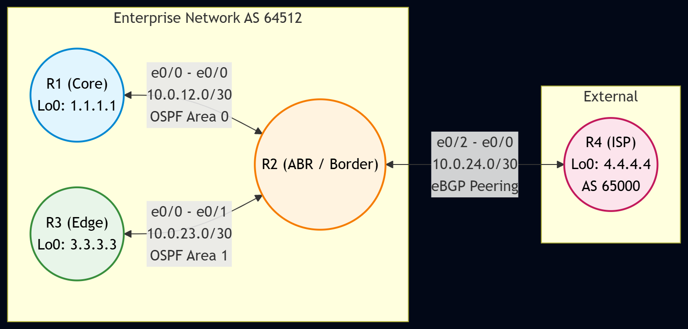

# LAB: Routing Multi-Dominio con OSPF e BGP

Questo repository documenta un laboratorio di rete focalizzato sul design e l'implementazione di tecnologie Layer 3 (in riferimento al Capitolo 8 della guida CCDE). Il progetto dimostra come interconnettere domini di routing differenti, gestire le adiacenze e applicare policy di selezione dei percorsi ottimali.

Il laboratorio è realizzato su piattaforma **PNetLab** utilizzando router Cisco.

## 🎯 Obiettivi del Design

1.  **Segmentazione del Dominio di Guasto:** Configurare OSPF multi-area per limitare la propagazione dei ricalcoli SPF.
2.  **Interconnessione Esterna:** Utilizzare BGP per la connettività verso domini esterni (es. ISP simulati), gestendo correttamente gli attributi.
3.  **Redistribuzione Controllata:** Implementare la redistribuzione tra protocolli IGP e BGP prevenendo routing loop tramite l'uso di route-map e tag.
4.  **Stabilità del Control Plane:** Ottimizzare le tabelle di routing tramite summarization e filtraggio dei prefissi.

## 🏗️ Topologia e Tecnologie

L'infrastruttura è composta da tre ruoli logici fondamentali:

### 1. Core Network (Transit)
* **Nodi:** Router R1 e R2.
* **Ruolo:** Backbone OSPF (Area 0).
* **Funzione:** Garantire il trasporto veloce e resiliente tra le varie sedi, gestendo le rotte interne del dominio.

### 2. Edge / Regional (Access)
* **Nodi:** Router R3.
* **Ruolo:** OSPF Stub Area / NSSA.
* **Funzione:** Rappresenta una filiale o un data center secondario isolato dalle instabilità del core.

### 3. Border Gateway (Peering)
* **Nodi:** Router R4.
* **Ruolo:** eBGP Peering Router.
* **Funzione:** Gestisce le sessioni BGP verso l'esterno, applicando policy di ingresso/uscita (es. Local Preference, AS-Path prepending).

## 🛠️ Software e Immagini Utilizzate

| Ruolo | Immagine PNetLab | Note |
| :--- | :--- | :--- |
| **Router (Core/Edge/Border)** | Cisco IOL (L3) | `L3-ADVENTERPRISEK9-M-15.5-2T` |

## 🚀 Scenari di Test

Il laboratorio copre i seguenti scenari di validazione:
1.  **Configurazione IGP:** Setup delle interfacce di loopback e instaurazione delle adiacenze OSPF tra R1, R2 e R3.
2.  **Configurazione EGP:** Instaurazione della sessione eBGP tra R4 e l'ISP simulato.
3.  **Redistribuzione e Policy:** Iniezione della default route da BGP a OSPF e filtraggio di specifici prefissi in ingresso.
4.  **Test di Convergenza:** * **Successo:** Il traffico da R3 raggiunge l'ISP tramite il percorso ottimale.
    * **Resilienza:** Disattivando il link primario, il traffico viene deviato sul link di backup grazie al ricalcolo OSPF/BGP.

---

## 🗺️ Diagramma di Rete

