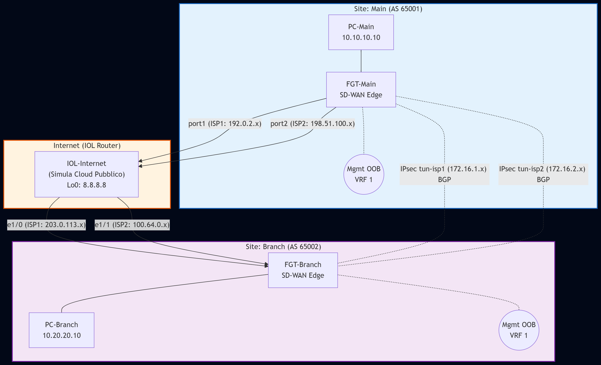

# Lab: SD-WAN con BGP Overlay e Traffic Steering su Dual ISP

## Obiettivo del Laboratorio
Simulare un'architettura Enterprise Site-to-Site (Main e Branch) utilizzando due connessioni ISP (Active/Active). Il laboratorio dimostra la separazione del traffico di management tramite VRF dedicata, la creazione di un underlay IP (Internet simulata) e un overlay sicuro (IPsec). Il routing dell'overlay è gestito dinamicamente tramite BGP, mentre il FortiOS SD-WAN si occupa del traffic steering basato sulle performance applicative (SLA).

## Immagini da Utilizzare
* **FortiGate (FGT):** FortiOS 7.x (es. `fortinet-FGT-v7.2.x`)
* **Cisco IOL:** L3 Router (es. `i86bi-linux-l3-adventerprisek9`)
* **VPC / Linux:** Qualsiasi immagine PC leggera per testare il traffico LAN.

## Numero Nodi
* 2x FortiGate (FGT-Main, FGT-Branch)
* 1x Cisco IOL (IOL-Internet)
* 2x VPC (PC-Main, PC-Branch)

## Tabella Cablaggio (Interfacce PNETLab vs FortiOS)

| Nodo Origine | Interfaccia Origine (PNET) | Nome Logico FGT | Nodo Destinazione | Interfaccia Destinazione | Scopo |
| :--- | :--- | :--- | :--- | :--- | :--- |
| FGT-Main | e0 | mgmt | Cloud/Switch | N/A | Management OOB (VRF 1) |
| FGT-Main | e1 | port1 | IOL-Internet | e0/0 | ISP 1 Underlay |
| FGT-Main | e2 | port2 | IOL-Internet | e0/1 | ISP 2 Underlay |
| FGT-Main | e3 | port3 | PC-Main | eth0 | LAN Main |
| FGT-Branch | e0 | mgmt | Cloud/Switch | N/A | Management OOB (VRF 1) |
| FGT-Branch | e1 | port1 | IOL-Internet | e1/0 | ISP 1 Underlay |
| FGT-Branch | e2 | port2 | IOL-Internet | e1/1 | ISP 2 Underlay |
| FGT-Branch | e3 | port3 | PC-Branch | eth0 | LAN Branch |

## Tabella Indirizzamento IP

| Dispositivo | Interfaccia | Indirizzo IP / Subnet | VRF | Descrizione |
| :--- | :--- | :--- | :--- | :--- |
| FGT-Main | mgmt (e0) | 10.255.0.1/24 | 1 | OOB Management |
| FGT-Main | port1 (e1) | 192.0.2.2/30 | 0 | Link ISP 1 |
| FGT-Main | port2 (e2) | 198.51.100.2/30 | 0 | Link ISP 2 |
| FGT-Main | port3 (e3) | 10.10.10.254/24 | 0 | Default Gateway LAN |
| FGT-Main | tun-isp1 | 172.16.1.1/30 | 0 | Overlay IPsec via ISP1 |
| FGT-Main | tun-isp2 | 172.16.2.1/30 | 0 | Overlay IPsec via ISP2 |
| FGT-Branch | mgmt (e0) | 10.255.0.2/24 | 1 | OOB Management |
| FGT-Branch | port1 (e1) | 203.0.113.2/30 | 0 | Link ISP 1 |
| FGT-Branch | port2 (e2) | 100.64.0.2/30 | 0 | Link ISP 2 |
| FGT-Branch | port3 (e3) | 10.20.20.254/24 | 0 | Default Gateway LAN |
| FGT-Branch | tun-isp1 | 172.16.1.2/30 | 0 | Overlay IPsec via ISP1 |
| FGT-Branch | tun-isp2 | 172.16.2.2/30 | 0 | Overlay IPsec via ISP2 |
| IOL-Internet| e0/0 | 192.0.2.1/30 | 0 | Verso FGT-Main ISP1 |
| IOL-Internet| e0/1 | 198.51.100.1/30 | 0 | Verso FGT-Main ISP2 |
| IOL-Internet| e1/0 | 203.0.113.1/30 | 0 | Verso FGT-Branch ISP1 |
| IOL-Internet| e1/1 | 100.64.0.1/30 | 0 | Verso FGT-Branch ISP2 |
| IOL-Internet| Loopback0 | 8.8.8.8/32 | 0 | IP di test / DNS |

## Network Diagram

