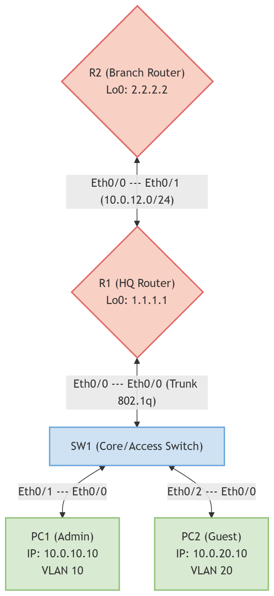

# Laboratorio: Security Is Pervasive (Cisco IOL su PNETLab)

## Contesto
Questo laboratorio pratico è progettato per implementare e testare i concetti fondamentali della sicurezza di rete in un ambiente simulato tramite PNETLab, utilizzando immagini Cisco IOL (IOS on Linux). 

La topologia simula una rete aziendale composta da una sede centrale (HQ - R1) connessa tramite un link WAN point-to-point a una filiale (Branch - R2). A livello locale, R1 è collegato a uno switch (SW1) che gestisce due segmenti di rete isolati: una VLAN dedicata agli amministratori (VLAN 10) e una destinata agli ospiti (VLAN 20). L'infrastruttura richiede la messa in sicurezza del Management Plane, del Control Plane e del Data Plane.

## Obiettivi del Laboratorio

Il workbook è suddiviso in tre macro-aree, ciascuna focalizzata su specifici standard di sicurezza:

### 1. Zero Trust Architecture (ZTA)
Applicazione del principio del privilegio minimo (Least Privilege) e segmentazione logica:
* **AAA e Role-Based Access Control (RBAC):** Configurazione dell'autenticazione locale e implementazione di *Parser Views* per limitare i comandi disponibili agli operatori di livello base (NOC).
* **Controllo degli Accessi (ACL):** Isolamento della rete Guest dalla rete Admin tramite policy di filtraggio del traffico.

### 2. Security CIA Triad
Implementazione delle misure per garantire Riservatezza, Integrità e Disponibilità:
* **Confidentiality:** Protezione dei dati in transito disabilitando protocolli in chiaro (Telnet) in favore di SSHv2, e crittografia delle credenziali archiviate localmente.
* **Integrity:** Protezione del Control Plane abilitando l'autenticazione crittografica (MD5) per gli aggiornamenti di routing OSPF tra i router.
* **Availability:** Resilienza del Layer 2 tramite le protezioni Spanning Tree (BPDU Guard e Root Guard) per prevenire attacchi all'albero STP o disservizi accidentali.

### 3. Regulatory Compliance
Soddisfacimento dei requisiti minimi per l'auditing, il tracciamento degli eventi e la conformità legale:
* **Sincronizzazione Temporale (NTP):** Configurazione di orari precisi e fusi orari per garantire l'affidabilità e la correlazione temporale dei log.
* **Centralizzazione (Syslog):** Inoltro degli eventi di sistema verso un server di raccolta log esterno.
* **Avviso Legale (MOTD):** Inserimento di banner di sistema che dichiarano esplicitamente il divieto di accesso non autorizzato, un requisito base per molte policy aziendali.

---

## Network Diagram

Di seguito la topologia logica e fisica di riferimento per le configurazioni:

